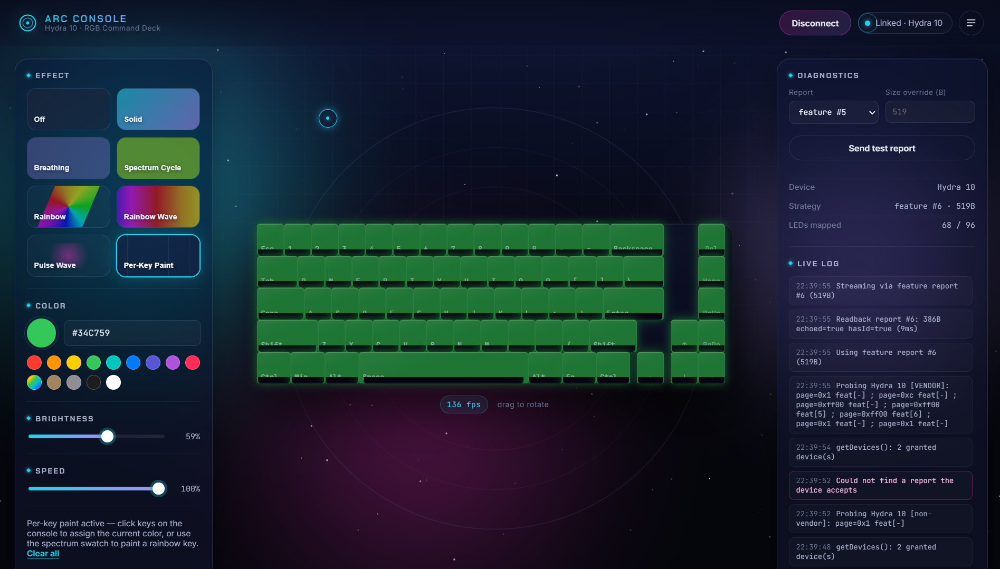

# Hydra 10 RGB Control

A desktop RGB control console for the [Portronics Hydra 10](https://www.portronics.com)
(SinoWealth 68-key, VID `0x258A` / PID `0x010C`) keyboard. Built with
Electron and WebHID, it streams lighting frames to the board in real time at
~30fps and renders a live 3D preview of the current effect.



## Features

- **8 lighting effects** — Off, Solid, Breathing, Spectrum Cycle, Rainbow,
  Rainbow Wave, Pulse Wave, and Per-Key Paint, each with a live preview tile.
- **Per-Key Paint** — click keys directly on the on-screen keyboard to assign
  individual colors, or paint the rainbow spectrum onto a single key.
- **Color, brightness & speed** — a color picker, hex field, quick presets,
  and glowing sliders that apply live to the physical board.
- **3D keyboard preview** — drag to orbit; mirrors the exact frame data being
  sent to the board at 30fps.
- **Continuous streaming** — a Web Worker keeps the 30fps tick running even
  when the window is in the background, so lighting never falls back to the
  board's built-in animation.
- **Diagnostics panel** — live report strategy, report options, a test-report
  sender, device info, an FPS counter, and a scrolling log.
- **Settings persistence** — color/effect/brightness/speed are saved across
  sessions via `localStorage`; unexpected disconnects auto-reconnect.

## Requirements

- Windows 10/11 (target platform)
- Google Chrome, Microsoft Edge, or Brave — Chromium-based browsers only,
  as WebHID is not supported in Firefox or Safari.
- A secure context: `http://localhost` or `https://`. The packaged Electron
  app runs over `file://`, which is always a secure context.

## Usage

1. Download the latest installer or portable build from the
   [Releases](../../releases) page.
2. Launch **Arc Console** and click **Connect keyboard**.
3. Choose the Hydra 10 in the device picker (only the Hydra 10 is ever
   offered or accepted).
4. Pick an effect, adjust color/brightness/speed, and paint individual keys
   directly on the 3D keyboard.

If multiple Hydra 10 units are connected, a menu lets you select which one
to control. Any non-Hydra HID device is always ignored.

## Development

```sh
npm install
npm start           # run the app
npm run dev         # run with dev flag
```

### Building the installers

```sh
npm run dist:win    # produces NSIS installer + portable exe in release/
```

## Project structure

| File | Purpose |
|---|---|
| `main.js` | Electron main process — window setup, WebHID permission grants. |
| `core.js` | Protocol engine (`window.RGB`) — connect, report detection, effects, packet builder, streaming. |
| `ticker.js` | Web Worker for background-tab 30fps ticking. |
| `ui.js` | Presentation layer — HUD, 3D keyboard, diagnostics, device picker. |
| `index.html` / `style.css` | Markup and the neon-ing theme. |

## Troubleshooting

- **"WebHID not supported"** — use a Chromium-based browser or the packaged
  app; WebHID requires a secure context.
- **Keyboard doesn't light up** — confirm your board is the Portronics
  Hydra 10 (VID `0x258A`, PID `0x010C`) and try the test report buttons in
  the Diagnostics panel.
- **Preview works but board is dark** — check that the status pill shows
  `Linked`; if the strategy was auto-negotiated as an output report, the
  diagnostics panel will show which report is in use.

## Credits

The key-to-LED mapping and protocol details are based on MRtojisan's
[portronics-hydra-10-SignalRGB-Plugin](https://github.com/MRtojisan/portronics-hydra-10-SignalRGB-Plugin) —
an unofficial SignalRGB plugin for the Portronics Hydra 10. Check it out if
you want full desktop synchronization and game sync via SignalRGB.

## License

[MIT](LICENSE)